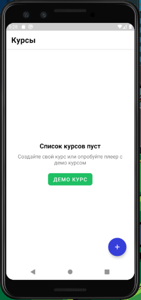
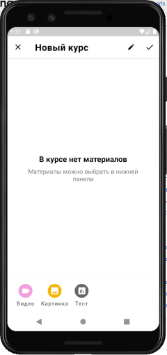

# Light

Приложение для создания курсов с использованием видео, изображений или тестов

Описание экранов:
* Список курсов - содержит созданные ранее пользователем курсы

  

* Конструктор курсов - позволяет выбрать элемент курса (видео, картинка, тест)

  

* Просмотр курсов - плеер для просмотра созданных курсов

Техническое описание
Экраны конструктора и списка созданы с применением паттерна MVVM
Экран плеера сделан с использованием MVI

В целом старался использовать подходы чистой архитектуры и кода, местами грязнил т.к. хотел побыстрее сделать фичу.

## Figma (экраны на странице 
https://www.figma.com/file/VabtYyKID7pvvYeGzMrRl6/Light?node-id=52%3A478
